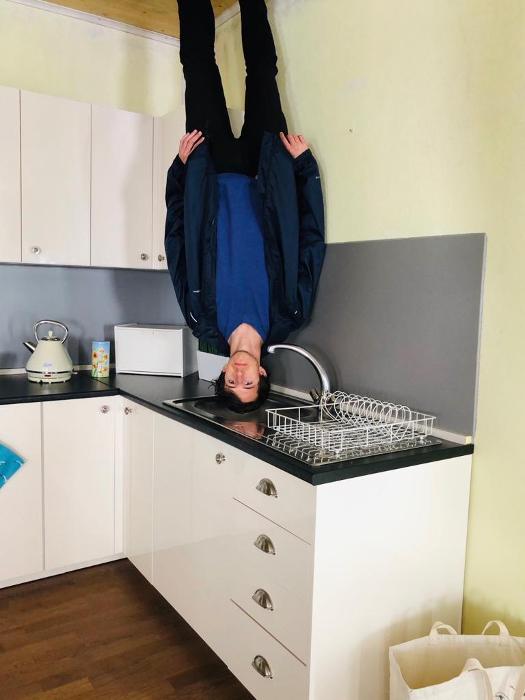

# Welcome to my website

  
  

    
Hi! I'm Simon. This is my website. It's still in progress so there isn't much here yet...

    
I'm a full stack software developer in the UK with about 10 years experience.
    I have a bunch of interests beyond coding which I hope to start writing about soon, if I find time.
    Mainly these are maths-y kinds of subjects like finance, but also some other areas like philosophy, fitness and politics.

    
This website was made from a heavily modified version of the <a href="https://github.com/pages-themes/leap-day">leap year</a> template.

    

